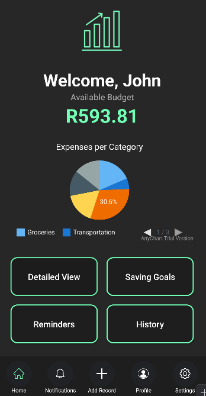
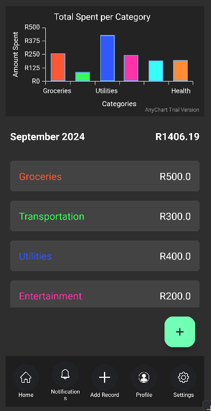
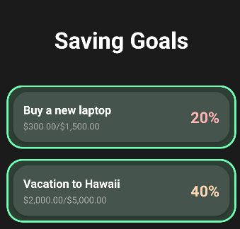

# SmartSpend API

SmartSpend is a comprehensive finance management application designed to help users track their income, expenses, savings, and goals. This README outlines the setup process, features of the app, and instructions for running automated tests using GitHub Actions.

## Table of Contents

- [Project Overview](#project-overview)
- [Features](#features)
- [Screenshots](#screenshots)
- [Installation](#installation)
- [Usage](#usage)
- [License](#license)

## Project Overview

The SmartSpend API provides users with a platform to manage and control their finances in one place. Key features include:

- Viewing and managing expenses and income.
- Setting and tracking savings and purchasing goals.
- Notifications and reminders for financial activities.
- Customizable themes and category-specific color coding.

## Features

1. **Income and Expense Management**: Allows users to view, add, and categorize their financial transactions.
2. **Savings Goals**: Users can create, track, and achieve their savings goals.
3. **Notification System**: Automated notifications to keep users informed about their progress.
4. **Dark Mode**: A sleek dark theme with green accents designed to enhance the user experience.
5. **Category Color Coding**: Users can assign colors to different categories for better tracking and visualization.

## Screenshots

Below are some screenshots of key parts of the SmartSpend app:

1. **Homepage**: Displays an overview of the user’s financial activities, including their expenses and income. 
   
   

2. **Detailed View**: Shows detailed information about a specific category, including all associated expenses and income.
   
   

3. **Goals Page**: Allows users to create, track, and manage their savings goals.
   
   

## Installation

To set up the project locally, follow these steps:

1. Clone the repository:

    ```bash
    git clone https://github.com/MarcoMeyer1/SmartSpend
    ```

2. Navigate into the project directory:

    ```bash
    cd smartspend
    ```

3. Install dependencies:

    ```bash
    ./gradlew build
    ```


## Usage

1. Open the app and log in using your credentials.
2. Add income and expense transactions in their respective sections.
3. Set savings goals and track your progress in the **Goals** section.
4. Manage and view detailed reports of your finances in the **Detailed View** section.

# Comprehensive Report
## Purpose of the app
SmartSpend is a way for you to manage and control your finances all in one application. It is a great way to see how you are spending your money and see where it is all going. This gives all the users a way to control and track all their finances, from seeing your expenses and income history to setting saving and purchasing goals. SmartSpend is a brilliant and efficient way to track all of these things while having an easy time navigating the application.

## Design considerations
The SmartSpend team has considered that a dark theme would suit this application, the light black and green tones compliments the application well, we have also added a colour feature for our categories so the user can easily track what they are spending their money on for each category, it just gives the user a better experience seeing the colour they have designated for that category instead of searching for it if each category was the same.

## Utilisation of Github and Github Actions
GitHub Actions are used to automatically trigger unit tests upon each commit, ensuring code quality is maintained throughout the development process.

The use of dorny/test-reporter@v1 neatly formats the test results, providing clear feedback on test success or failure directly within the GitHub interface. 

## License

This project is licensed under the MIT License - see the LICENSE file for details.
